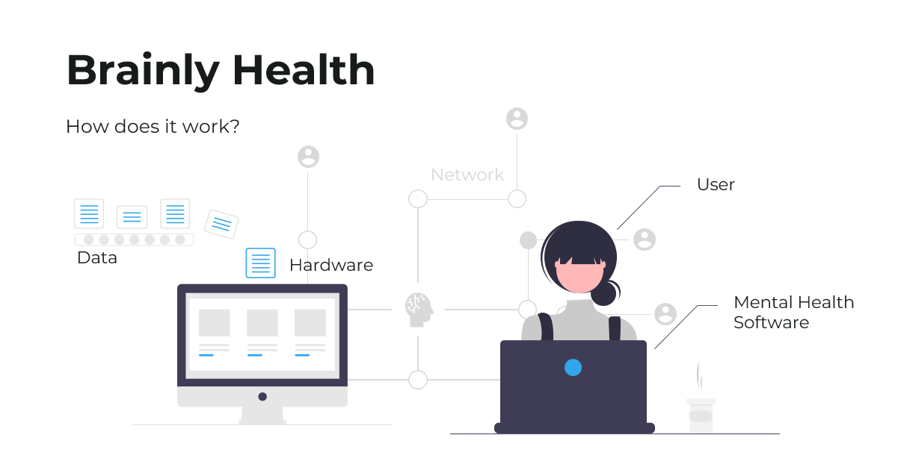

# Brainly Health



>Computer-based system that utilizes artificial intelligence techniques to simulate the knowledge and expertise of mental health professionals. It aims to assist in the diagnosis, treatment, and management of mental health disorders.
---
By Ximena Toledo

## How does it work?
>To use the expert system, you can query ```mental_health_diagnosis``` in the Prolog interpreter. The system will prompt the user with questions about symptoms and then provide a possible diagnosis based on the input provided.